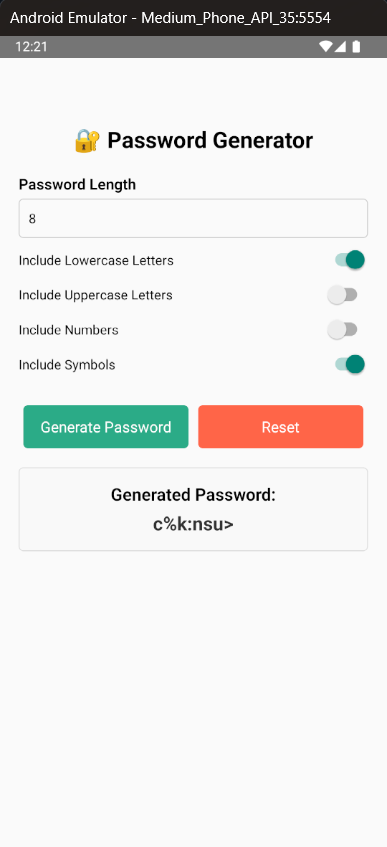

# Password Generator App

A **React Native CLI** application that generates a random password based on user-selected criteria, such as lowercase letters, uppercase letters, numbers, and symbols. The app utilizes **Formik** for form handling and **Yup** for validation.

---

## 📌 Features
- Set password length (4 to 16 characters)
- Toggle options for including lowercase, uppercase, numbers, and symbols
- Generate and display a secure random password
- Reset options and password with a button
- Form validation using **Formik** and **Yup**

---

## 📲 Installation & Setup

### 1️⃣ Prerequisites
Ensure you have the following installed:
- **Node.js**: [Download](https://nodejs.org/)
- **React Native CLI**: Install using the command:
  ```sh
  npm install -g react-native-cli
  ```
- **Android Studio/Xcode**: Required for running the app on emulators

### 2️⃣ Clone the Repository
```sh
git clone https://github.com/5ujay/React-Native.git
cd React-Native/Project03
```

### 3️⃣ Install Dependencies
```sh
npm install
```

### 4️⃣ Run the App
For **Android**:
```sh
npx react-native run-android
```
For **iOS**:
```sh
npx react-native run-ios
```

---

## 📂 Project Structure
```
password-generator-rn-cli/
├── android/       # Android-specific files
├── ios/           # iOS-specific files
│   App.tsx        # Main App file (Main code)
├── package.json   # Project dependencies
├── README.md      # Project documentation
```

---

## 🛠️ Technologies Used
- **React Native CLI**
- **Formik** (for form handling)
- **Yup** (for validation)
- **React Native Paper** (for UI components)

---

## 📷 Screenshot


---

## 🏆 Credits
sujay pagam 🚀

