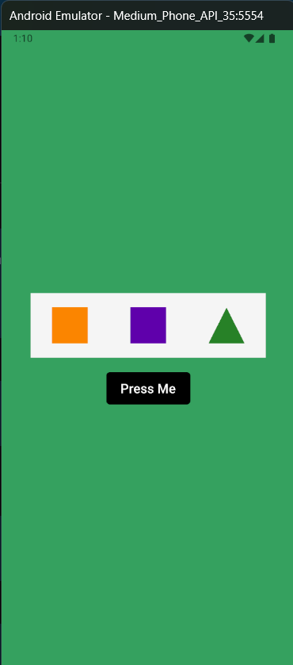
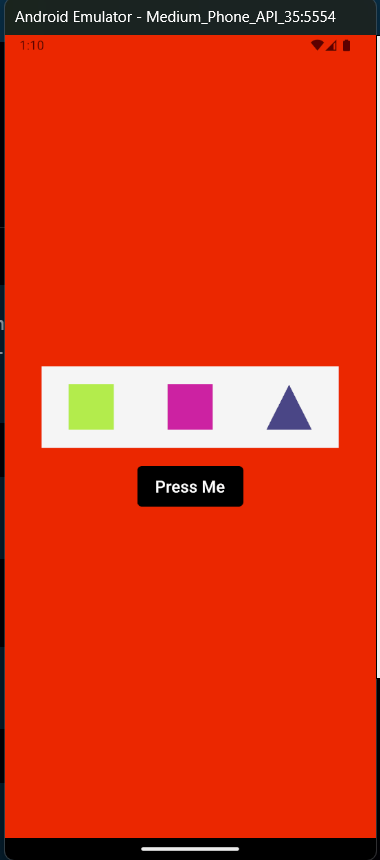

# 🎨 Random Color Generator App

## 📌 Project Info
A simple React Native CLI app that randomly changes the background color and shape colors when a button is pressed. 🎲✨

## 🖼️ Image
<div style="display: flex; flex-direction: row; gap: 10px;">
  
  
</div>

## 🛠️ Tech Stack
- ⚛️ React
- 📱 React Native
- 🏗️ React Native CLI
- 📝 TypeScript
- 🤖 Android Studio

## 🚀 Installation & Setup

### 1️⃣ Clone the Repository
```sh
git clone https://github.com/5ujay/React-Native.git
cd React-Native/Project04
```

### 2️⃣ Install Dependencies
```sh
npm install
# OR
yarn install
```

### 3️⃣ Run the App
For **Android**:
```sh
npx react-native run-android
```

For **iOS**:
```sh
npx pod-install  # Ensure CocoaPods are installed
iOS simulator must be running
npx react-native run-ios
```

Thanks! 🎉🚀

