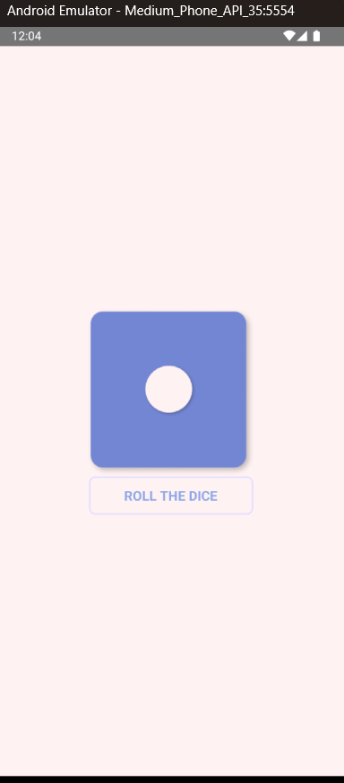
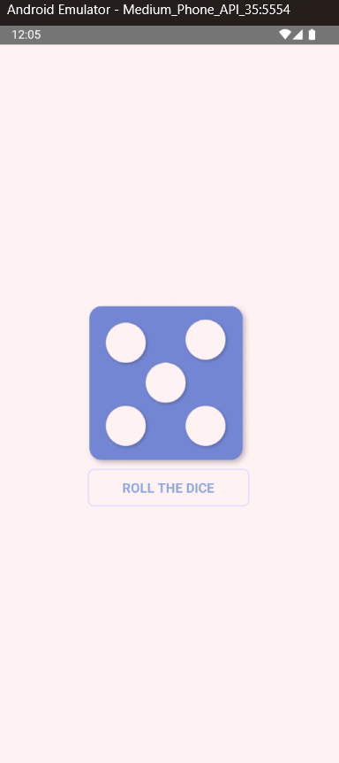

# 🎲 React Native Dice Roller

This is a simple **React Native Dice Roller** app where users can roll a dice by pressing a button. The app provides haptic feedback and displays a random dice face.

## 📌 Features
- 🎲 **Random Dice Roll**: Generates a random number between 1 and 6. Vibrates when rolling the dice for a better experience.
- 🎨 **Simple UI**: Clean and user-friendly interface.

## 🚀 Installation & Setup

### 1️⃣ Clone the Repository
```sh
git clone https://github.com/5ujay/React-Native.git
cd React-Native/Project05
```

### 2️⃣ Install Dependencies
```sh
npm install
# OR
yarn install
```

### 3️⃣ Run the App
For **Android**:
```sh
npx react-native run-android
```

For **iOS**:
```sh
npx pod-install  # Ensure CocoaPods are installed
iOS simulator must be running
npx react-native run-ios
```

## 🛠️ Technologies Used
- **React Native** - Core framework

## 🖼️ Screenshots
| Dice Roll Output |
|------------------|
|  |
|  |

## 🤝 Contribution
Feel free to fork this repository and submit pull requests for improvements or new features! 😊

Thank YOU 🚀

