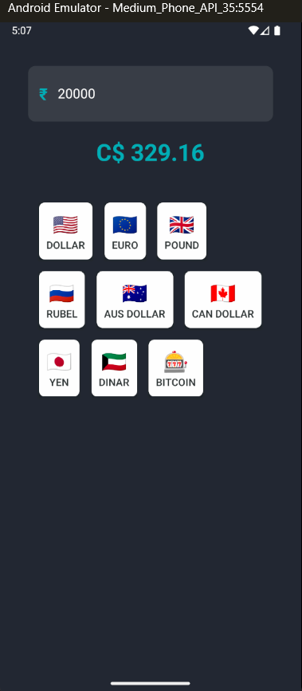

# Currency Converter App



A simple and efficient React Native currency converter app that allows users to convert Indian Rupees (INR) to various foreign currencies using predefined exchange rates.

## Features
- Convert INR to multiple currencies with accurate exchange rates
- User-friendly and responsive UI with dark mode support
- Instant conversion feedback with a clean interface
- Error handling with React Native Snackbars
- Optimized for mobile devices with smooth UI interactions

## Screenshots
### Conversion Result


## Tech Stack
- **React Native**
- **Expo** (for easy development and testing)
- **React Native Snackbar** (for error notifications)

## Setup Instructions
1. **Clone the repository:**
   ```sh
   git clone https://github.com/5ujay/React-Native.git
   cd React-Native/Project06
   ```
2. **Install dependencies:**
   ```sh
   npm install
   ```
3. **Start the development server:**
   ```sh
   npx expo start
   ```
4. **Run the app:**
   - Scan the QR code with the Expo Go app (Android/iOS) to test the app on a mobile device.
   
## File Structure
```
Project06/
│── components/
│   ├── CurrencyButton.tsx
│── constants.ts
│── indes.d.ts
│── App.tsx
```

## Contributing
We welcome contributions! Feel free to fork this repository, create a new branch, and submit a pull request with your improvements.


