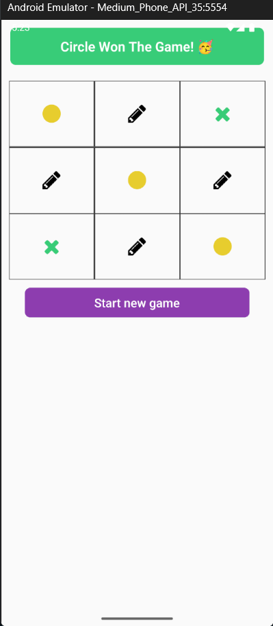

# Tic-Tac-Toe Game 🎮

A simple Tic-Tac-Toe game built using React Native CLI. The game allows two players to play turn by turn and determines the winner based on classic Tic-Tac-Toe rules.

## 📂 Project Structure

The project consists of two main files:

- **`App.tsx`**: Contains all the main game logic.
- **`Icons.tsx`**: Handles rendering icons for X and O.

## 🚀 Getting Started

### Prerequisites

- Node.js installed
- React Native CLI setup
- Android/iOS emulator or physical device

### Installation

1. Clone the repository:
   ```sh
   git clone https://github.com/5ujay/React-Native.git
   cd Project07
   ```
2. Install dependencies:
   ```sh
   npm install
   ```
3. Run the project:
   ```sh
   npx react-native run-android  # For Android
   npx react-native run-ios      # For iOS (Mac required)
   ```

## 🕹️ How to Play

1. The game starts with player O.
2. Players take turns tapping on an empty cell.
3. The first player to align three marks (horizontally, vertically, or diagonally) wins!
4. If all cells are filled without a winner, the game ends in a draw.
5. Click the "reLoad / Start" button to play again.

## 🎥 Reference

For better Tic-Tac-Toe logic, check out this YouTube video: [Tic-Tac-Toe Logic](https://www.youtube.com/watch?v=qU_gdQ1FvjM)

## 📸 Screenshots

<div style="display: flex; flex-direction: row; gap: 10px;">
  
  
</div>

Made with ❤️ using React Native.
